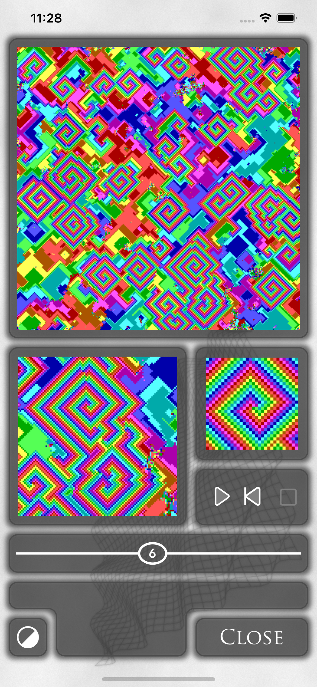
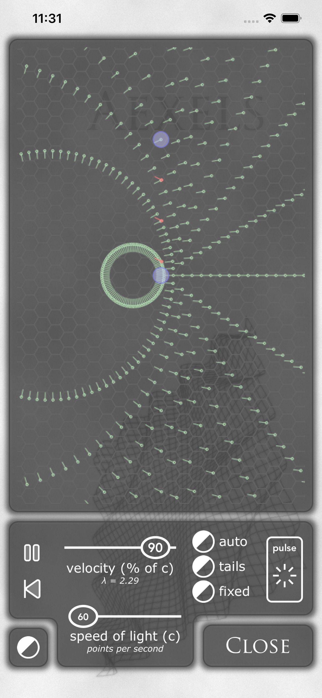
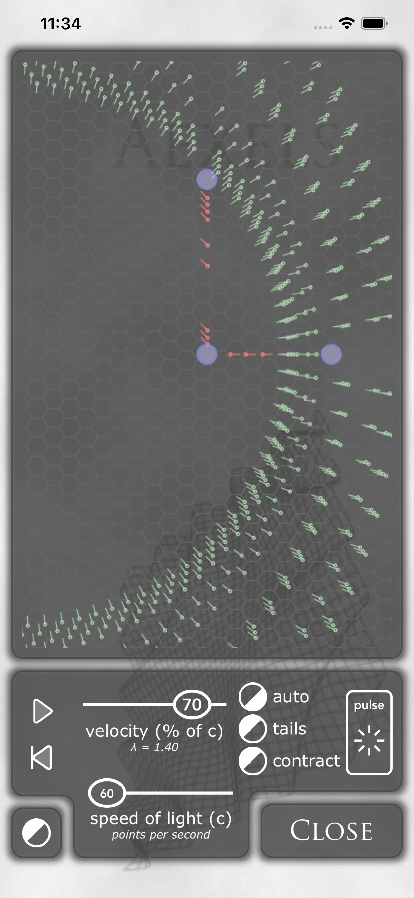
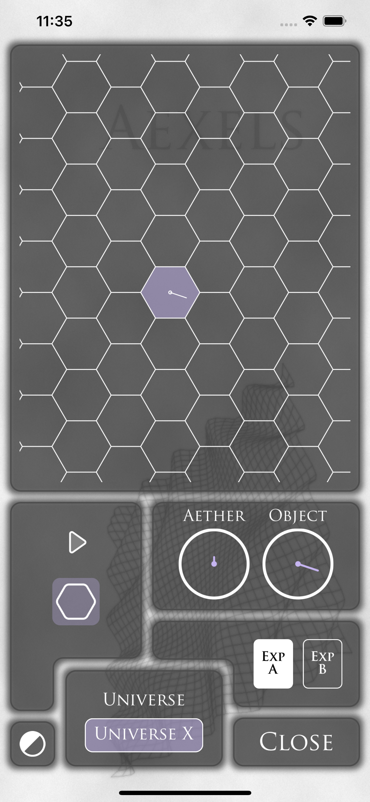

# Aexels
a universe is discovered

Available in the AppStore (iOS, macOS, iPadOS): [Aexels](https://apps.apple.com/us/app/aexels/id935727868)

 

Universe X

 1. At a base level Universe X is made up of normal cartesian space and normal cartesian time.  Placed in this cartesian space is a quantized aether made up of tiny cells, I'm calling aexels.  The individual aexels form bonds with their direct neighbors that don't let them get too close or too far from one another.
As a result this aether is a compressible liquid crystal lattice; it can flow; it can stretch, it can squish.  Each individual aexel can have state; the states of these aexels can be communicated to their neighbors; it takes one 'tic' of time for a signal to move from an aexel to its neighbor.  The fastest a signal can move across the aether is one aexel per tic.  In Universe X one aexel per tic is referred to as the speed of light.

 2. These state signals that jump from aexel to aexel can loop back to a previous state forming a stable state loop analogous to the 'particles' of Conway's Game of Life.  These stable state loops form the basis of all matter in Universe X.
Some of these loops have a property called 'mass'.  Mass is a measure of the rate at which the loop destroys the aexels it is sitting upon.  As these loops destroy aexels more aexels get pulled towards them due to the crystalline nature of the aether.  As this occurs the 'mass' itself starts to clump up forming bigger and denser clumps of matter.
As these clumps get more and more dense the rate at which aexels are flowing towards the clumps increases.  Once the rate increases past one aexel per tic (the speed of light) the clump of matter becomes a black hole.
In Universe X gravity is not a force, rather it's simply the acceleration of the aether as it moves closer and closer to clumps of matter.

 3. Just as in our universe the particles of Universe X are created through pair creation.  During pair creation a particle and its antiparticle are created that are equal and opposite to one another.  As a particle with mass is created, an antiparticle with antimass is also created; the mass destroys aexels and the antimass creates them.
And while the particles tend to clump up into planets and stars and black holes, the antiparticles continually spread out as a dust between the particle clumps creating new aether at the same rate that the particles are destroying them.  This creates new aether between galaxies and as such causes light traveling between those galaxies to become red shifted.
Also the aexels being created between the galaxies cause a pushing on the outside of galaxies at the same time as the destruction of aexels in the inside of galaxies is causing a pulling.  It may be difficult to differentiate between pulling from the inside and pushing from the outside.

 4. All of the loops in Universe X can be divided between loops that move in a straight-line at the speed of light and loops that move back and forth in some alternating fashion at a net velocity of less than the speed of light.
The directly moving loops are called edisons, the alternating loops are called teslons.  The teslons can form complex composite structures.  The motion of these structures are mediated by edisons.  Due to the particular mechanism used in E&M only the roundtrip duration of the journey of these edisons between teslons matter.
This round trip time will entirely be a function of the rate at which a composite system is translating across the aexels.  If the system is not translating at all, the edisons will move maximally between the teslons and the composite system will animate quickest.  As a system translates faster and faster across the aexels, the edisons will take longer and longer to travel back forth causing the rate of animation of the composite system to slow down.
Translating systems will experience 'animation' dilation.  Systems sitting still on a planet's surface will also experience animation dilation for the exact same reason because the aexels are flowing into the planet.  As such, even though the system doesn't appear to be moving, it is still translating across the aexel field (at the escape velocity).

 5. Length contraction also exists in Universe X and is also entirely a function of the rate of translation of the composite system.  Without length contraction differences in the roundtrip journey time between edisons moving perpendicular and parallel to the direction of translation would become apparent, but with length contraction, the difference is precisely masked and as a result the round trip time is equal in both directions.
 
 6. Actually, it is not mass and antimass that destroy aexels it is the translation of a conserved quantity called 'hyle'.  Teslons and antiteslons have internal structure with hyle translating back and forth.  This hyle is what destroys and creates the aexels.  Photons are also made up of hyle and destroy and create aexels as they translate, but always in their wake not internal to themselves.  Hyle is the source of all aexel destruction, mass; it is the source of all translation, energy; it is the source of all aexel creation, antimass.

## 3 Potential Descrepancies

A discussion of 3 ways in which Universe X may differ from ours.

### Lorentz Covariance

My original thinking on the MMX was that with aexels, the flow of aether would be directly into the Earth and since the MMX was only looking for changes of the aethereal flow horizontal to the surface of the Earth the null result would make sense in Universe X, but that if somehow someone could repeat a vertical version of the experiment the flow could be seen.

However, I later realized that a vertical MMX would show a null result in Universe X just as it would in ours and it does so because of length contraction.

Here is a [video](https://www.youtube.com/watch?v=QMwKmdHTo9U) which vividly illustrates this phenomena.

### Schwarzschild Metric

In Universe X, since gravity is not a force, it can not directly cause a system to translate over the aexels, only E&M can do that.  As such, a tennis ball placed infinitely far from a static non-rotating planet will not translate across the aexels, but rather will just float down on top of them as they flow towards the planet like a leaf floating down a stream.

As such, the motion of the tennis ball will indicate the motion of the aexels themselves.  Using Newton's law of Gravitation we can calculate the velocity of the tennis ball when it hits the planet, which is the escape velocity.  That velocity will indicate the velocity of aexels flowing into the planet at the surface, therefore, we can then calculate the dilation at the surface of the planet by simply plugging the escape velocity into the Lorentz factor.

Perhaps shockingly, this calculation which uses only concepts of Universe X exactly foots with the time dilation at the surface of a non-rotating planet in our universe.

However, using this same analysis we can "calculate" the dilation of the tennis ball as it's falling towards the planet.  The tennis ball is never translating across the aexels and therefore will never experience any dilation on its journey from infinity to the planet.

The same analysis in our universe using the [Schwarzschild metric](https://en.wikipedia.org/wiki/Schwarzschild_metric) will instead net $\gamma(v_e)^2$ (where $\gamma$ is the Lorentz factor and $v_e$ is the escape velocity).

So, it seems we have found a discrepancy!  The problem is that while there have been a handful of experiments that have verified the phenomena of 'time dilation', 'warping of spacetime', 'expansion of the universe', there have been none showing that the Schwarzschild metric is physical and actually there are [indications](https://physics.stackexchange.com/questions/744073/how-do-we-know-the-assumptions-of-the-schwarzschild-solution-are-valid) that it is not.

### Minkowski Space

One of the first steps in the derivation of General Relativity is to define a 4-vector with time and 3 spacial dimensions and define a value $ds^2=dt^2-dx^2$ and then assert that $ds^2$ is an invariant value in all inertial frames.

It is quite easy to devise a thought experiment in Universe X and see that $ds^2$ would not be invariant in all frames in Universe X.

So, once again it seems we've found a discrepancy!  But, just as before there never has been any experimental verification of Minkowski's assertion that $ds^2$ is invariant in our Universe.

(And the fact that we see the ISS's clocks moving faster and they see our clocks moving slower seems to directly counter Minkowski's assertion.)

The result being that I still have not been able to find an experiment that would net different results in Universe X and our Universe.
